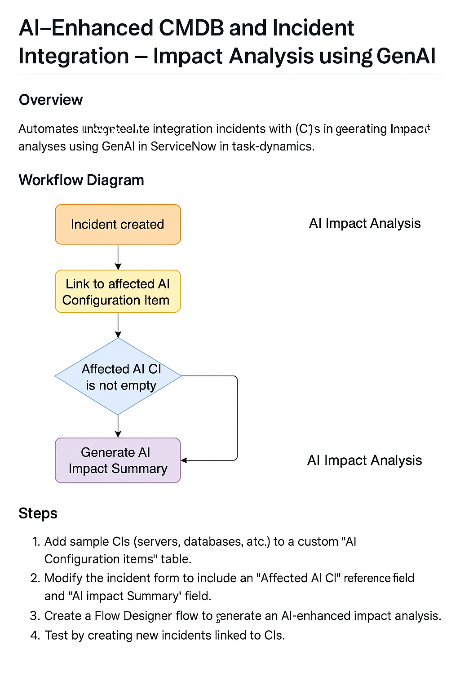

# ServiceNow_ITOM_Project7
AI-Enhanced CMDB &amp; Incident Impact Analysis
# ServiceNow Project: AI-Enhanced CMDB & Incident Impact Analysis
**Date:** Nov 12, 2025  

## 📘 Objective
Simulate CMDB and automate incident impact analysis using AI-style logic in ServiceNow.  
When a new Incident is linked to a Configuration Item (CI), the system automatically generates a GenAI-style impact summary describing the affected asset and its criticality.

---

## ⚙️ Steps to Build
1. **Create Custom CMDB Table**
   - Table: `AI Configuration Items [u_ai_configuration_items]`
   - Fields:
     - Name (String)
     - Type (Choice: Server, Database, Application)
     - Criticality (Choice: High, Medium, Low)
     - Owner (Reference → User)

2. **Add Reference in Incident Table**
   - Field: **Affected AI CI** (`u_ai_affected_ci`) → Reference: AI Configuration Items  

3. **Add AI Impact Summary Field**
   - Field: **AI Impact Summary** (`u_ai_impact_summary`) → Type: String  

4. **Create Flow Designer Automation**
   - Trigger: *When Incident is created*
   - Condition: *Affected AI CI is not empty*
   - Action: **Update Record → AI Impact Summary =**
     ```
     AI Impact Analysis:
     The incident affects ${Affected AI CI.name}, which is a ${Affected AI CI.type}
     with ${Affected AI CI.criticality} criticality.
     Please assess service dependencies and potential downtime impact.
     ```

5. **Activate & Test**
   - Link an Incident to a sample AI CI → check AI Impact Summary auto-fills.

---

## 🤖 AI Integration
| Component | Function |
|------------|-----------|
| Custom CMDB Simulation | Stores Configuration Items with type & criticality |
| Flow Designer | Automates AI-style analysis |
| GenAI Summary | Generates readable impact explanation |

---

## 🎯 Outcome
- Automated impact visibility for incidents  
- AI-based summary text reduces manual analysis  
- CMDB simulation that mirrors enterprise behavior  

---

## 🧩 Future Enhancements
- Integrate REST API to AIOps or OpenAI for real-time insights  
- Auto-escalate incidents for high-criticality assets  
- Add dependency mapping between AI Configuration Items  

---

## 🖼️ Diagram


---

## 🧠 Learning Highlights
- Understood CMDB fundamentals and relationships  
- Simulated Configuration Items in PDI  
- Implemented AI-driven impact assessment  
- Combined Flow Designer logic with GenAI communication style  
